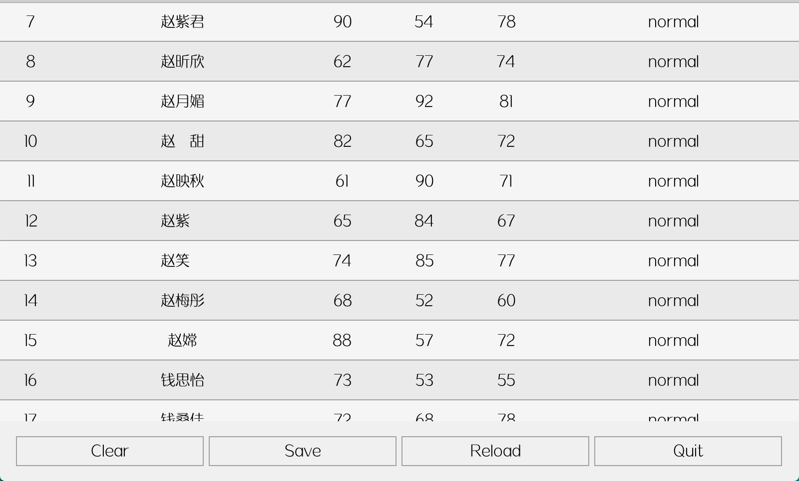
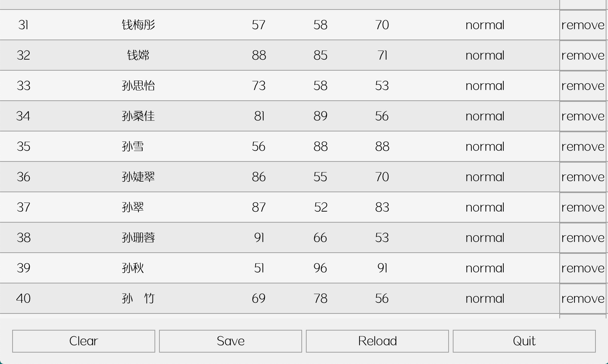
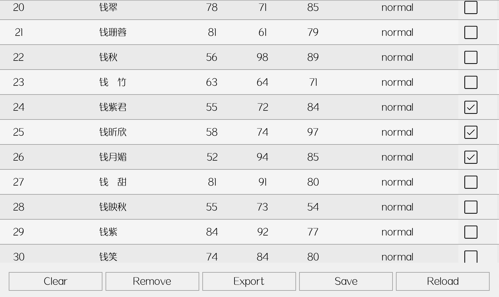
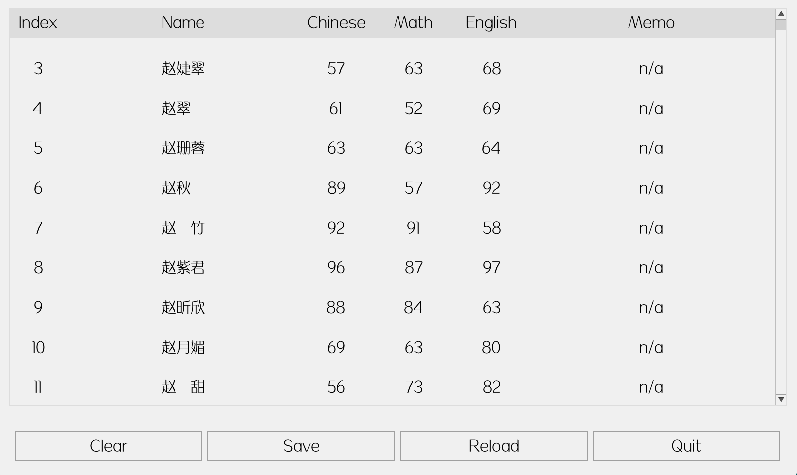
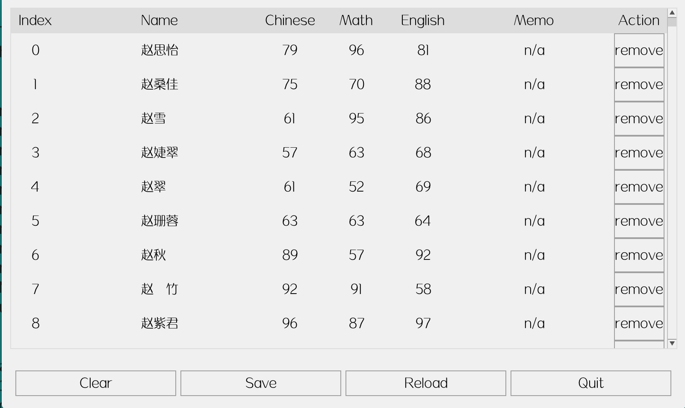
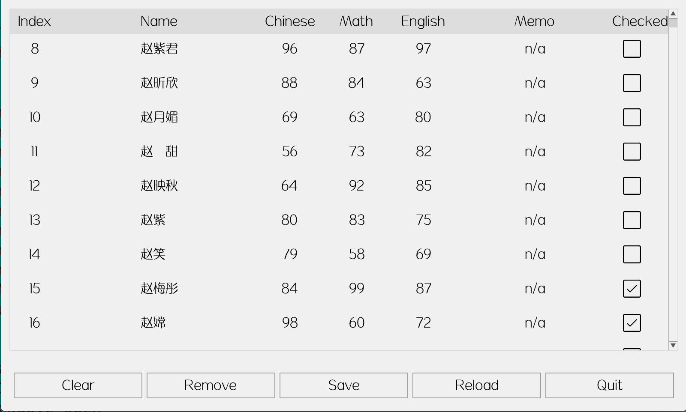

# awtk-mvvm-c-examples

mvvm c 语言版本示例。

> 本项目中的例子依赖其它一些库，不太适合放到 awtk-mvvm 项目中，因此把它独立出来了。

## 准备

1. 获取 awtk 并编译

```
git clone https://github.com/zlgopen/awtk.git
cd awtk; scons; cd -
```

2. 获取 awtk-mvvm 并编译

```
git clone https://github.com/zlgopen/awtk-mvvm.git
cd awtk-mvvm; scons; cd -
```

3. 获取 awtk-widget-table-view 并编译

```
git clone https://github.com/zlgopen/awtk-widget-table-view.git
cd awtk-widget-table-view; scons; cd -
```

4. 获取 awtk-widget-table-view-mvvm 并编译

```
git clone https://github.com/zlgopen/awtk-widget-table-view-mvvm.git
cd awtk-widget-table-view-mvvm; scons; cd -
```

5. 获取 awtk-widget-slidable-row 并编译

```
git clone https://github.com/zlgopen/awtk-widget-slidable-row.git
cd awtk-widget-slidable-row; scons; cd -
```

## 运行

1. 生成示例代码的资源

```
python scripts/update_res.py all
```
> 也可以使用 Designer 打开项目，之后点击 “打包” 按钮进行生成
> 如果资源发生修改，则需要重新生成资源。

2. 编译

* 编译PC版本

```
scons
```

* 编译LINUX FB版本

```
scons LINUX_FB=true
```

> 完整编译选项请参考[编译选项](https://github.com/zlgopen/awtk-widget-generator/blob/master/docs/build_options.md)


3. 运行

* csv 文件查看



```
./bin/csv_view
```

* csv 文件查看和删除



```
./bin/csv_view_remove
```

* csv 文件查看、删除和导出



```
./bin/csv_view_checkable
```

* csv 文件查看 (table view 版本）



```
./bin/table_csv_view
```

* csv 文件查看和删除 (table view 版本）



```
./bin/table_csv_view_remove
```

* csv 文件查看、删除和导出 (table view 版本）



```
./bin/table_csv_view_checkable
```

## 参考

* [awtk-mvvm](https://github.com/zlgopen/awtk-mvvm)
